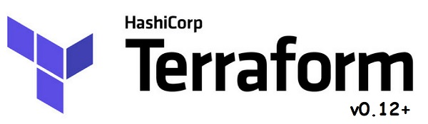

<br>

# Terraform 0.12+ Lessons by Denis Astahov for AWS
https://www.youtube.com/watch?v=R0CaxXhrfFE&list=PLg5SS_4L6LYujWDTYb-Zbofdl44Jxb2l8


```
Lesson-01 Create,Update,Destroy	
Lesson-02 with WebServer via bootstrap	
Lesson-03 using external file for user_data	
Lesson-04 using dynamic file via templatefile	
Lesson-05 with Dynamic Blocks in SecurityGroup	
Lesson-06 with LifeCycle and EIP	
Lesson-07 with Outputs and multiply .tf files	
Lesson-08 with Dependencies depends_on	
Lesson-09 with AWS Data Sources	
Lesson-10 with AWS Data Sources for Lookup AMIid	
Lesson-11 with HighlyAvailable WEB and ZeroDown Time Blue/Green Deployment	
Lesson-12 with Variables	
Lesson-13 with Variables Auto Filling	
Lesson-14 with Local Variables	
Lesson-15 with Executing local commands on Terraform server	
Lesson-16 with Generate Password, store in SSM and use it	
Lesson-17 with Conditions and Lookups	
Lesson-18 with Loops: count, for if	
Lesson-19 with Deploy to Multi Regions/Accounts	
Lesson-20 with Terraform Remote State	
Lesson-21 with Terraform Modules	
Lesson-22 with Folder Hiererchy for Multi Environment projects	
Lesson-23 with Terraform Global Variables	
Lesson-24 with GCP - Google Cloud Platform	
Lesson-25 with Links and Resources
```
